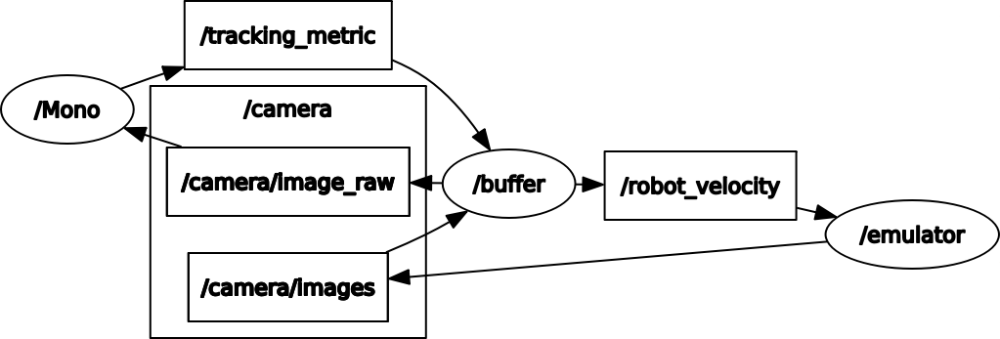
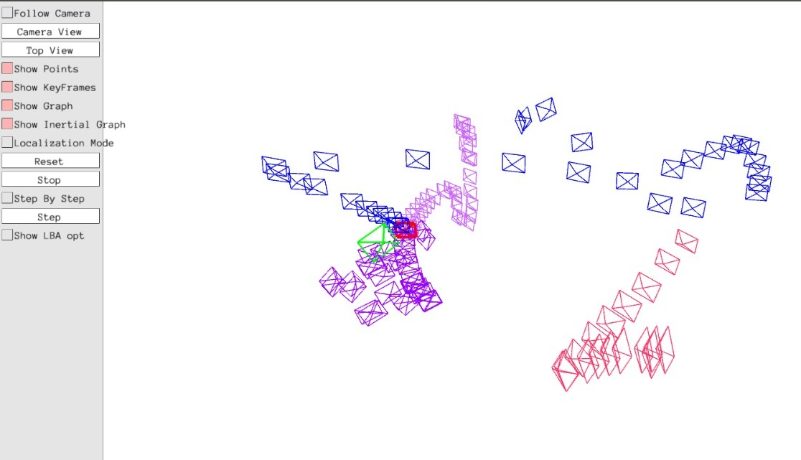
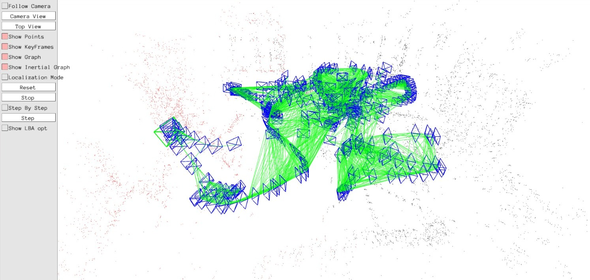
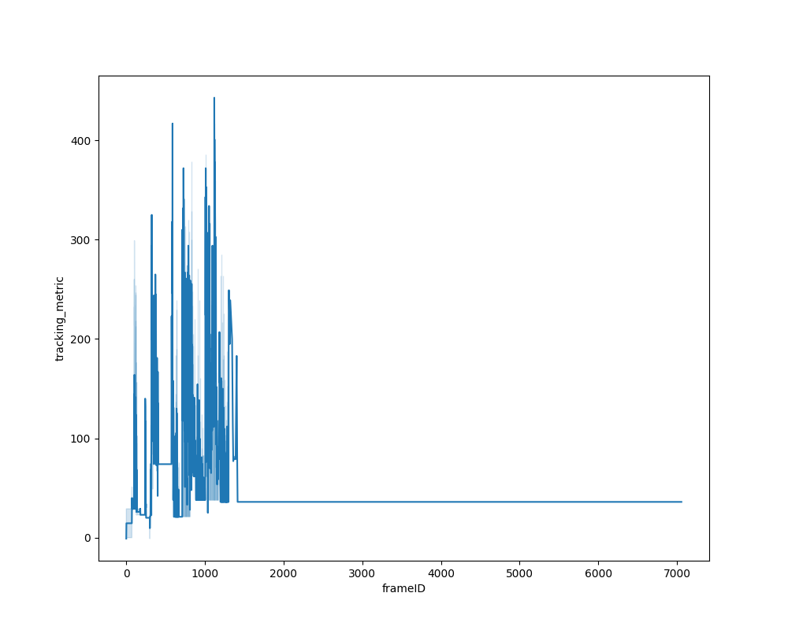
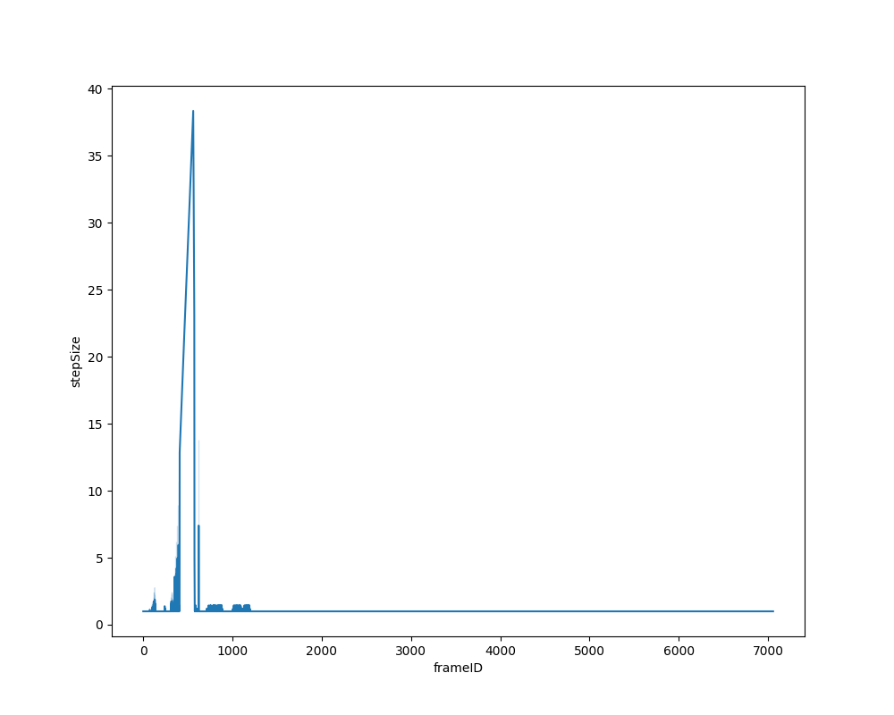
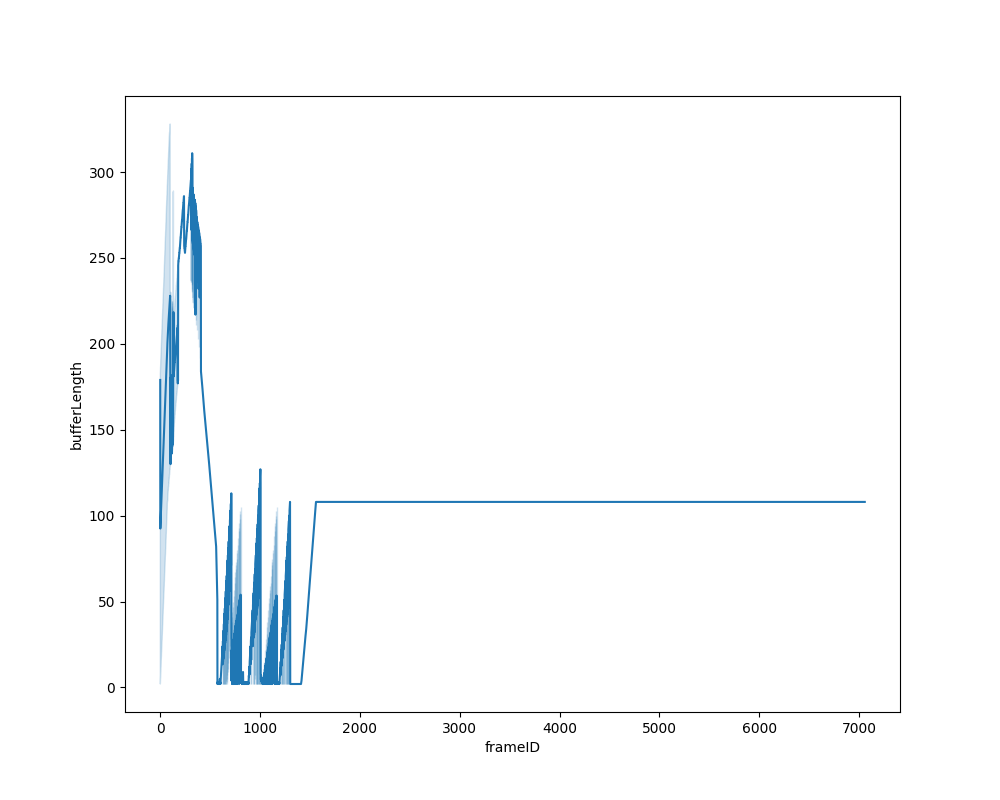
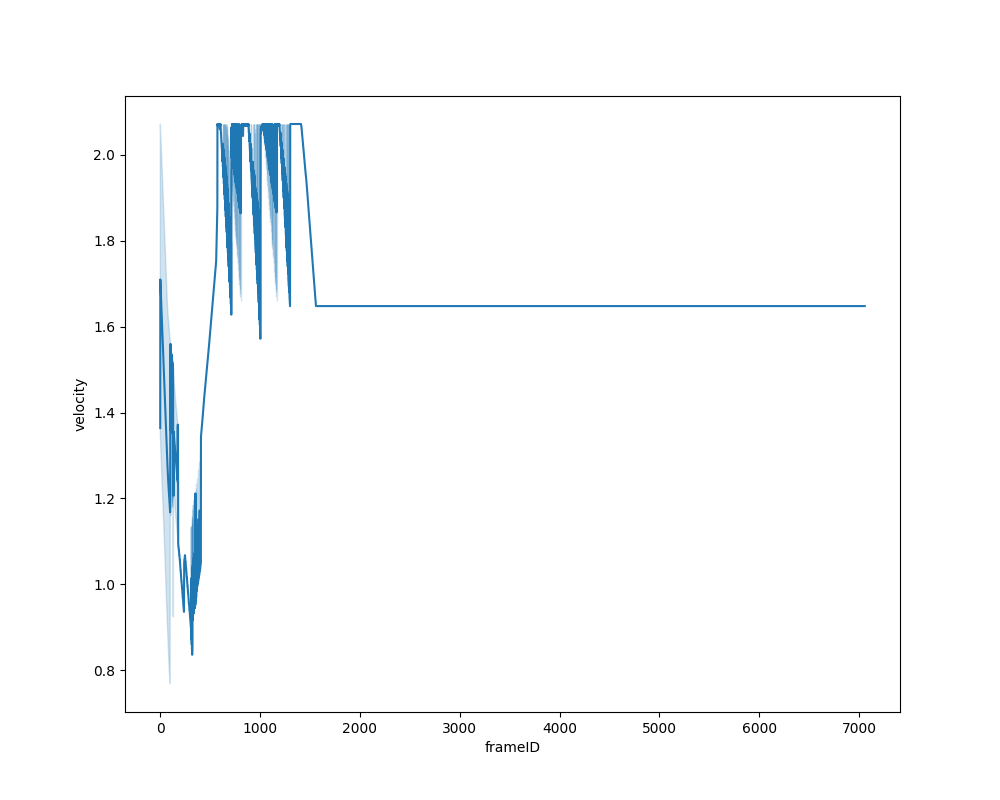

# FLEXIBLE-ORB-SLAM3

### V1.0, December 22th, 2021
**Authors:** Carlos Campos, Richard Elvira, Juan J. Gómez Rodríguez, [José M. M. Montiel](http://webdiis.unizar.es/~josemari/), [Juan D. Tardos](http://webdiis.unizar.es/~jdtardos/).

The [Changelog](https://github.com/UZ-SLAMLab/ORB_SLAM3/blob/master/Changelog.md) describes the features of each version.

ORB-SLAM3 is the first real-time SLAM library able to perform **Visual, Visual-Inertial and Multi-Map SLAM** with **monocular, stereo and RGB-D** cameras, using **pin-hole and fisheye** lens models. In all sensor configurations, ORB-SLAM3 is as robust as the best systems available in the literature, and significantly more accurate. 

We provide examples to run ORB-SLAM3 in the [EuRoC dataset](http://projects.asl.ethz.ch/datasets/doku.php?id=kmavvisualinertialdatasets) using stereo or monocular, with or without IMU, and in the [TUM-VI dataset](https://vision.in.tum.de/data/datasets/visual-inertial-dataset) using fisheye stereo or monocular, with or without IMU. Videos of some example executions can be found at [ORB-SLAM3 channel](https://www.youtube.com/channel/UCXVt-kXG6T95Z4tVaYlU80Q).

This software is based on [ORB-SLAM2](https://github.com/raulmur/ORB_SLAM2) developed by [Raul Mur-Artal](http://webdiis.unizar.es/~raulmur/), [Juan D. Tardos](http://webdiis.unizar.es/~jdtardos/), [J. M. M. Montiel](http://webdiis.unizar.es/~josemari/) and [Dorian Galvez-Lopez](http://doriangalvez.com/) ([DBoW2](https://github.com/dorian3d/DBoW2)).

<a href="https://youtu.be/HyLNq-98LRo" target="_blank"></a>

### Related Publications:

[ORB-SLAM3] Carlos Campos, Richard Elvira, Juan J. Gómez Rodríguez, José M. M. Montiel and Juan D. Tardós, **ORB-SLAM3: An Accurate Open-Source Library for Visual, Visual-Inertial and Multi-Map SLAM**, *IEEE Transactions on Robotics 37(6):1874-1890, Dec. 2021*. **[PDF](https://arxiv.org/abs/2007.11898)**.

[IMU-Initialization] Carlos Campos, J. M. M. Montiel and Juan D. Tardós, **Inertial-Only Optimization for Visual-Inertial Initialization**, *ICRA 2020*. **[PDF](https://arxiv.org/pdf/2003.05766.pdf)**

[ORBSLAM-Atlas] Richard Elvira, J. M. M. Montiel and Juan D. Tardós, **ORBSLAM-Atlas: a robust and accurate multi-map system**, *IROS 2019*. **[PDF](https://arxiv.org/pdf/1908.11585.pdf)**.

[ORBSLAM-VI] Raúl Mur-Artal, and Juan D. Tardós, **Visual-inertial monocular SLAM with map reuse**, IEEE Robotics and Automation Letters, vol. 2 no. 2, pp. 796-803, 2017. **[PDF](https://arxiv.org/pdf/1610.05949.pdf)**. 

[Stereo and RGB-D] Raúl Mur-Artal and Juan D. Tardós. **ORB-SLAM2: an Open-Source SLAM System for Monocular, Stereo and RGB-D Cameras**. *IEEE Transactions on Robotics,* vol. 33, no. 5, pp. 1255-1262, 2017. **[PDF](https://arxiv.org/pdf/1610.06475.pdf)**.

[Monocular] Raúl Mur-Artal, José M. M. Montiel and Juan D. Tardós. **ORB-SLAM: A Versatile and Accurate Monocular SLAM System**. *IEEE Transactions on Robotics,* vol. 31, no. 5, pp. 1147-1163, 2015. (**2015 IEEE Transactions on Robotics Best Paper Award**). **[PDF](https://arxiv.org/pdf/1502.00956.pdf)**.

[DBoW2 Place Recognition] Dorian Gálvez-López and Juan D. Tardós. **Bags of Binary Words for Fast Place Recognition in Image Sequences**. *IEEE Transactions on Robotics,* vol. 28, no. 5, pp. 1188-1197, 2012. **[PDF](http://doriangalvez.com/php/dl.php?dlp=GalvezTRO12.pdf)**

# 1. License

ORB-SLAM3 is released under [GPLv3 license](https://github.com/UZ-SLAMLab/ORB_SLAM3/LICENSE). For a list of all code/library dependencies (and associated licenses), please see [Dependencies.md](https://github.com/UZ-SLAMLab/ORB_SLAM3/blob/master/Dependencies.md).

For a closed-source version of ORB-SLAM3 for commercial purposes, please contact the authors: orbslam (at) unizar (dot) es.

If you use ORB-SLAM3 in an academic work, please cite:
  
    @article{ORBSLAM3_TRO,
      title={{ORB-SLAM3}: An Accurate Open-Source Library for Visual, Visual-Inertial 
               and Multi-Map {SLAM}},
      author={Campos, Carlos AND Elvira, Richard AND G\´omez, Juan J. AND Montiel, 
              Jos\'e M. M. AND Tard\'os, Juan D.},
      journal={IEEE Transactions on Robotics}, 
      volume={37},
      number={6},
      pages={1874-1890},
      year={2021}
     }

# 2. Prerequisites
The above official repository list installation steps for the package. However, the package could not be build with the steps given in the repository. The following repo consist of all errors encountered while building the package along with ways to debug those errors. 

## C++11 or C++0x Compiler
We use the new thread and chrono functionalities of C++11.

## Pangolin
We use [Pangolin](https://github.com/stevenlovegrove/Pangolin) for visualization and user interface. Dowload and install instructions can be found at: https://github.com/stevenlovegrove/Pangolin.

## OpenCV
We use [OpenCV](http://opencv.org) to manipulate images and features. Dowload and install instructions can be found at: http://opencv.org. 
**Required at leat 3.0. Tested with OpenCV 3.2.0**

## Eigen3
Required by g2o (see below). Download and install instructions can be found at: http://eigen.tuxfamily.org. **Required at least 3.1.Tested with version 3.3.50**.

## DBoW2 and g2o (Included in Thirdparty folder)
We use modified versions of the [DBoW2](https://github.com/dorian3d/DBoW2) library to perform place recognition and [g2o](https://github.com/RainerKuemmerle/g2o) library to perform non-linear optimizations. Both modified libraries (which are BSD) are included in the *Thirdparty* folder.

## Python
Required to calculate the alignment of the trajectory with the ground truth. **Required Numpy module**.

* (deb) `sudo apt install libpython2.7-dev`

# 3. ROS Approach

We provide some examples to process input of a monocular, monocular-inertial, stereo, stereo-inertial or RGB-D camera using ROS. Building these examples is optional. 
**
These have been tested with ROS Melodic under Ubuntu 18.04.**

## Installing Dependencies for ORB-SLAM3 library

### C++ Compiler

To confirm your C++ version, simply use the following command in the terminal:

```bash
g++ --version
```
### Pangolin

Pangolin is a lightweight library for managing OpenGL display and interaction. 

Follow these steps to install it:
```bash
git clone https://github.com/stevenlovegrove/Pangolin.git
cd Pangolin
mkdir build
cd build
cmake ..
cmake --build .
sudo make install
```

Install missing dependencies if encountered:
```bash
sudo apt install libgl1-mesa-dev
sudo apt install libglew-dev
sudo apt install libpython2.7-dev
sudo apt install pkg-config
sudo apt install libegl1-mesa-dev libwayland-dev libxkbcommon-dev wayland-protocols
```

Test the installation using the example:
```bash
cd build/examples/HelloPangolin
./HelloPangolin
```


### OpenCV

OpenCV is a popular computer vision library. Install it using the following steps:

1)Navigate to the opencv folder and open a terminal

```bash
mkdir build
cd build
cmake -D CMAKE_BUILD_TYPE=Release -D CMAKE_INSTALL_PREFIX=/usr/local ..

```

### Eigen3

Eigen3 is a linear algebra library. Install it as follows:

After downloading the compressed file, extract it to your workspace.
Navigate to the eigen-3.3.5 folder and open a terminal:

```bash
mkdir build
cd build
cmake ..
sudo make install
```

Verify the installation:
```bash
locate eigen3
```


### DBoW2 and g2o

The source code for DBoW2 and g2o is already present in the Thirdparty folder.

### Python 2.7

Python 2.7 is required to calculate the alignment of the trajectory with the ground truth. Make sure you have the Numpy module installed:

```bash
sudo apt install libpython2.7-dev
```

# 4. ORB SLAM3 Compilation Guide

Clone the repository:
```
git clone https://github.com/UZ-SLAMLab/ORB_SLAM3.git ORB_SLAM3
```
**Commit Hash: 
https://github.com/UZ-SLAMLab/ORB_SLAM3/commit/4452a3c4ab75b1cde34e5505a36ec3f9edcdc4c4
Commit Date: Feb 10, 2022**

The build.sh script compiles five different binaries. Building those binaries individually helps debug errors efficiently. 

The following instructions will guide you through the process of compiling the ORB SLAM3 package. This guide assumes that you are using a Linux-based system and are comfortable using the terminal.


### Compiling Thirdparty Libraries

1. Open a terminal and navigate to the ORB SLAM3 directory:
   ```
   cd ORB_SLAM3
   ```

2. Compile Thirdparty/DBoW2 library:
   ```
   cd Thirdparty/DBoW2
   mkdir build
   cd build
   cmake .. -DCMAKE_BUILD_TYPE=Release
   make -j
   ```

3. Compile g2o library:
   ```
   cd ../../g2o
   mkdir build
   cd build
   cmake .. -DCMAKE_BUILD_TYPE=Release
   make -j
   ```

4. Compile Sophus library:
   ```
   cd ../../Sophus
   mkdir build
   cd build
   cmake .. -DCMAKE_BUILD_TYPE=Release
   make -j
   ```

### Compiling Vocabulary

1. Navigate back to the main ORB SLAM3 directory:
   ```
   cd ../../../
   ```

2. Extract the Vocabulary:
   ```
   cd Vocabulary
   tar -xf ORBvoc.txt.tar.gz
   cd ..
   ```

### Compiling ORB SLAM3

1. Compile the ORB SLAM3 library:
   ```
   mkdir build
   cd build
   cmake .. -DCMAKE_BUILD_TYPE=Release
   make -j4
   ```

### Issues Faced During Compilation

If you encounter issues while compiling the ORB SLAM3 project, you might come across the following errors along with their respective solutions:

#### 1. Error: `fatal error: boost/serialization/serialization.hpp: No such file or directory`

**Solution:**
You can resolve this issue by installing the required Boost library. Open a terminal and run the following command:
```bash
sudo apt install libboost-filesystem-dev
```

#### 2. Error: `fatal error: openssl/md5.h: No such file or directory`

**Solution:**
To fix this error, you need to install the OpenSSL development package. Run the following command in your terminal:
```bash
sudo apt-get install libssl-dev
```

#### 3. Error: `/usr/bin/ld: cannot find -lboost_serialization...`

**Solution:**
You can resolve this issue by installing the complete Boost library. Execute the following command in your terminal:
```bash
sudo apt install libboost-all-dev
```

#### 4. Error: `ORB SLAM3 Compilation Error - Unable to find OpenCV 4.4...`

**Solution:**
This error can be fixed by modifying the `CMakeLists.txt` file under the ORB_SLAM3 directory. Locate the line `find_package(OpenCV 4.4)` and replace it with:
```cmake
find_package(OpenCV 3.2.0)
if(NOT OpenCV_FOUND)
    message(FATAL_ERROR "OpenCV > 4.4 not found.")
endif()
```

#### 5. Issue: OpenCV Installation Error - "ICV: Downloading ippicv linux 20151201.tgz..."

**Solution:**
You need to manually download the ippicv_linux_20151201.tgz package from [this link](https://pan.baidu.com/s/1In12KXpDK-EwVOAXv7iWVA). After downloading, follow these steps:
1. Navigate to your OpenCV source directory.
2. Create a 'build' directory.
3. Enter the 'build' directory and run CMake to generate the build files:
   ```bash
   cmake -D CMAKE_BUILD_TYPE=Release -D CMAKE_INSTALL_PREFIX=/usr/local ..
   ```
4. Build and install OpenCV:
   ```bash
   sudo make
   sudo make install
   ```
5. Update your shared library configuration:
   ```bash
   sudo gedit /etc/ld.so.conf.d/opencv.conf
   ```
   Add the line `/usr/local/lib` at the end of the file.
6. Update the dynamic linker:
   ```bash
   sudo ldconfig
   ```
7. Add OpenCV to your bash environment variables:
   ```bash
   sudo gedit /etc/bash.bashrc
   ```
   Add these lines at the end of the file:
   ```bash
   PKG_CONFIG_PATH=$PKG_CONFIG_PATH:/usr/local/lib/pkgconfig
   export PKG_CONFIG_PATH
   source /etc/bash.bashrc
   sudo updatedb
   ```

#### 6. Error: ROS Environment Variable Issue and Directory Change

**Solution:**
Ensure that you update your `~/.bashrc` file with the correct environment variable path for ROS and adjust the directory changes as follows:
```bash
export ROS_PACKAGE_PATH=${ROS_PACKAGE_PATH}:/path/to/ORB_SLAM3/Examples_old/ROS
cd /path/to/ORB_SLAM3/Examples_old/ROS/ORB_SLAM3
mkdir build
cd build
cmake .. -DROS_BUILD_TYPE=Release
make -j
```

#### 7. Error: ROS Build Error - Incorrect ROS PACKAGE PATH

**Solution:**
Check your ROS PACKAGE PATH in your `~/.bashrc` file and make sure it's correctly set:
```bash
export ROS_PACKAGE_PATH=${ROS_PACKAGE_PATH}:/path/to/ORB_SLAM3/Examples_old/ROS
```

#### 8. Error: `CMakeFiles/MonoAR.dir/build.make:198: recipe for target...`

**Solution:**
Install the required Boost library by executing the following command:
```bash
sudo apt install libboost-filesystem-dev
```

#### 9. Error: `fatal error: sophus/se3.h: No such file or directory`

**Solution:**
In the `CMakeLists.txt` file located in `ORB_SLAM3/Examples_old/ROS/ORB_SLAM3`, add `${PROJECT_SOURCE_DIR}/../../../Thirdparty/Sophus` to the `include_directories` section.

#### 10. Error with `cv::Mat Tcw = mpSLAM->TrackMonocular(...)`

**Solution:**
Modify the line to handle the transformation from Sophus to OpenCV matrices:
```cpp
cv::Mat Tcw;
Sophus::SE3f Tcw_SE3f = mpSLAM->TrackMonocular(...);
Eigen::Matrix4f Tcw_Matrix = Tcw_SE3f.matrix();
cv::eigen2cv(Tcw_Matrix, Tcw);
```

#### 11. Error with `vPoints.push_back(pMP->GetWorldPos());`

**Solution:**
Replace the line with:
```cpp
cv::Mat WorldPos;
cv::eigen2cv(pMP->GetWorldPos(), WorldPos);
vPoints.push_back(WorldPos);
```

Also, replace instances of:
```cpp
cv::Mat Xw = pMP->GetWorldPos();
```
with:
```cpp
cv::Mat Xw;
cv::eigen2cv(pMP->GetWorldPos(), Xw);
```

For further assistance and community discussions, refer to the [ORB SLAM3 GitHub repository](https://github.com/UZ-SLAMLab/ORB_SLAM3). Make sure to follow the instructions carefully to successfully compile and run the project.

# 5. Running ORB-SLAM3 with ROSBAG

To run ORB SLAM 3 on ROS-Melodic, follow these steps. Open three terminals and execute the commands as shown:

### Terminal 1: Launch ROS Core
```bash
roscore
```

### Terminal 2: Run ORB SLAM 3 Stereo Mode
```bash
rosrun ORB_SLAM3 Stereo Vocabulary/ORBvoc.txt Examples_old/Stereo/EuRoC.yaml true
```

### Terminal 3: Play ROS Bag
```bash
rosbag play --pause V1_03_difficult.bag /cam0/image_raw:=/camera/left/image_raw /cam1/image_raw:=/camera/right/image_raw
```

In Terminal 1, the `roscore` command launches the ROS core, which is required for communication between ROS nodes.

In Terminal 2, the `rosrun` command executes ORB SLAM 3 in stereo mode. Make sure to provide the correct paths to the ORB vocabulary file (`Vocabulary/ORBvoc.txt`) and the configuration file (`Examples_old/Stereo/EuRoC.yaml`). The `true` parameter enables visualization.

In Terminal 3, the `rosbag play` command is used to play a ROS bag file containing camera data. The `--pause` flag starts the bag in a paused state, allowing you to synchronize it properly. The command uses remapping to connect the bag's camera topics (`/cam0/image_raw` and `/cam1/image_raw`) to the ORB SLAM 3 expected topics (`/camera/left/image_raw` and `/camera/right/image_raw`).

With these steps, you can effectively run ORB SLAM 3 on ROS-Melodic using stereo camera input. Remember to replace file paths and topic names as needed for your specific setup.

# 6. Observation and Analysis
# Visualizing ORB SLAM 3 Outputs

## ROS Graph Visualization

This figure illustrates the ROS graph visualization using RQT. It showcases the communication flow between different ROS nodes in the system.

## ORB SLAM 3 Outputs

### ORB SLAM 3: Euroc Dataset V1-03-Difficult

The image above displays the output of ORB SLAM 3 on the Euroc dataset V1-03-Difficult. The system tracks and maps the environment using visual odometry techniques.

## Flexible SLAM Outputs

### ORB SLAM 3 with Buffer: Euroc Dataset V1-03-Difficult

This image showcases the output of ORB SLAM 3 with a buffer applied to the Euroc dataset V1-03-Difficult. The buffer enhances tracking performance and overall SLAM accuracy.

## Analysis: ORB SLAM 3 with Buffer

### Tracking Metric Plot: Euroc Dataset V1-03-Difficult

The graph above depicts the tracking metric plot obtained from running ORB SLAM 3 with a buffer on the Euroc dataset V1-03-Difficult. It provides insights into tracking quality throughout the SLAM process.

### Step Size Plot: Euroc Dataset V1-03-Difficult

This figure represents the step size plot, revealing the variations in camera movement step sizes during the SLAM process on the Euroc dataset V1-03-Difficult.

### Buffer Length Plot: Euroc Dataset V1-03-Difficult

The buffer length plot showcases the changes in buffer size over time during the SLAM process on the Euroc dataset V1-03-Difficult.

### Velocity Plot: Euroc Dataset V1-03-Difficult

The velocity plot illustrates the changes in camera velocity during the SLAM process on the Euroc dataset V1-03-Difficult.

For a comprehensive analysis of ORB SLAM 3 outputs and performance, refer to the provided graphs and visualizations. These visual insights offer valuable information about the system's behavior and efficiency.

# 7. REFERENCES

GitHub Repository: [https://github.com/Kuzuri15/ORB_SLAM3_Project](https://github.com/Kuzuri15/ORB_SLAM3_Project)

